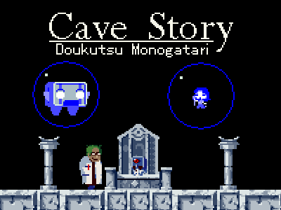

This project is a recreation inspired by the classic indie game [Cave Story](https://en.wikipedia.org/wiki/Cave_Story). While not a fully faithful recreation, this demo draws heavily from the original game's aesthetics and gameplay style, implemented using SDL2, SDL2_images and tinyXML.

#### Features

- Utilizes Cave Story freeware assets for graphics.
- Custom-designed maps.
- Built with SDL2, SDL2_image, and TinyXML.

#### Installation 

To play the Cave Story-Inspired Demo, follow these steps:

1. Clone this repository to your local machine using `git clone https://github.com/vss84/cave-story-demo.git`.
2. Navigate to the project directory.
3. Compile the project using your preferred C++ compiler, ensuring SDL2 and SDL2_image libraries are installed.
4. Run the compiled executable.

#### Dependencies

This project relies on the following libraries:

- [SDL2](https://www.libsdl.org/) - Simple DirectMedia Layer for cross-platform multimedia.
- [SDL2_image](https://www.libsdl.org/projects/SDL_image/) - SDL2 extension for loading various image formats.

#### Controls

|                           | P1        |
| ------------------------- | --------- |
| Movement                  | `← ↑ ↓ →` |
| Jump                      | `Z`       |

- `Q / Esc` - Quit Game

#### Screenshots

Freeware

#### Credits

- Studio Pixel/Nicalis for Cave Story
- [chebert](https://github.com/chebert/cavestory-screencast) - parts of it are used as reference.
- [Limeoats](https://github.com/Limeoats/cavestory-development) - used as a basis for the game engine.